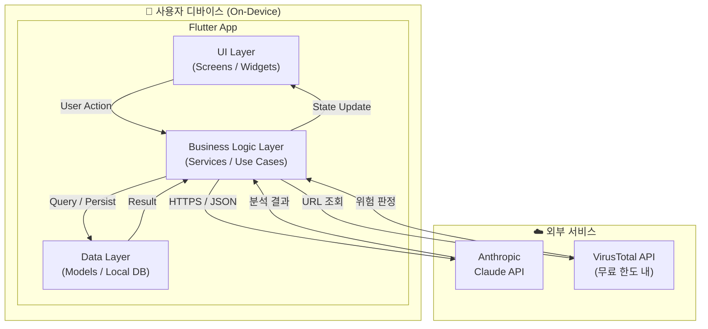
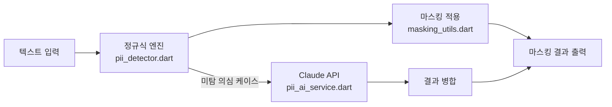
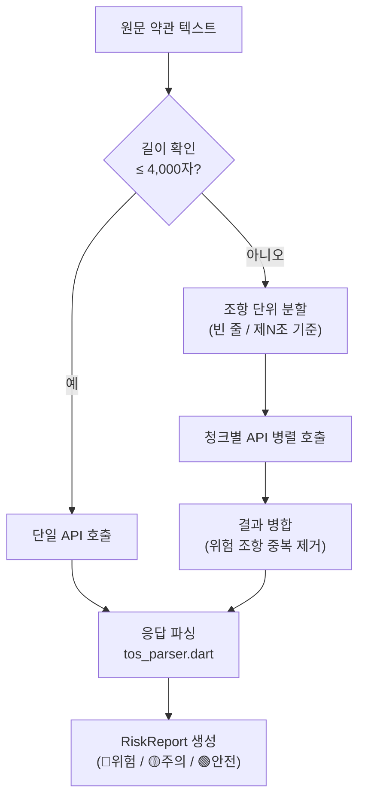
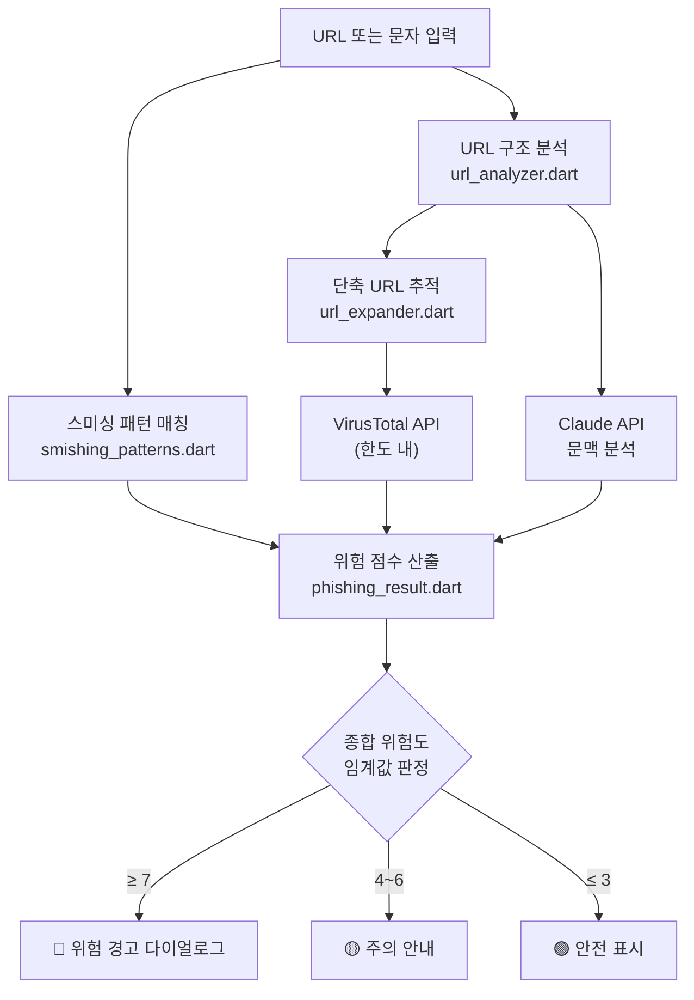

# 03-architecture: Guardian AI 시스템 아키텍처

> 작성: AI Agent 자동 생성 / 본인 검토 필요 (2026-05-19)  
> 연관 문서: `00-vision.md`, `01-requirements.md`, `02-wbs.md`

---

## 1. 아키텍처 개요

Guardian AI는 **Flutter 기반 클라이언트 단독 앱**이다.  
별도 백엔드 서버를 운영하지 않으며, 모든 처리는 온디바이스(로컬) 또는 **Anthropic Claude API** 직접 호출로 처리한다.

### 핵심 설계 원칙

| 원칙 | 내용 |
|------|------|
| Privacy First | 원문 텍스트를 서버(자체)에 저장하지 않음. API 호출 후 즉시 폐기 |
| Local-First | PII 탐지 1차 처리는 정규식 로컬 엔진. API는 보조 역할 |
| Offline Graceful Degradation | API 불가 시 로컬 처리 결과만 반환, 앱 동작은 유지 |
| Single Codebase | Flutter로 Android / iOS 동시 지원 |

---

## 2. 전체 시스템 구조



---

## 3. 레이어 상세 설명

### 3.1 UI Layer — `lib/features/`

화면(Screen)과 위젯(Widget)만 담당. 비즈니스 로직을 직접 호출하지 않고 Service 클래스를 통해 간접 호출.

| 화면 | 경로 | 역할 |
|------|------|------|
| 온보딩 | `lib/features/onboarding/` | 최초 실행 3단계 안내 |
| 홈 대시보드 | `lib/features/home/` | 최근 분석 요약, 탭 진입점 |
| PII 마스킹 | `lib/features/pii/` | 텍스트 입력 → 마스킹 결과 표시 |
| 약관 분석 | `lib/features/tos/` | 약관 입력 → 위험 조항 카드 뷰 |
| 피싱 탐지 | `lib/features/phishing/` | URL/문자 입력 → 위험 판정 |
| 히스토리 | `lib/features/history/` | 과거 분석 목록 조회 |

### 3.2 Business Logic Layer — `lib/services/`

API 호출, 로컬 처리 엔진, 에러 처리, 결과 캐싱을 담당.

```
lib/services/
├── claude_client.dart        # Claude API HTTP 클라이언트 (공통)
├── pii_ai_service.dart       # Claude API PII 보조 인식
├── tos_service.dart          # 약관 분석 (청킹 + API 호출 + 결과 병합)
├── phishing_ai_service.dart  # 피싱 문맥 분석
└── cache_service.dart        # 응답 캐싱 (입력 해시 → 결과)
```

**데이터 흐름 예시 — 약관 분석:**

```
[사용자 텍스트 입력]
        ↓
tos_service.dart
  1. 텍스트 길이 확인
  2. 길면 → 청킹(chunk by 조항 단위)
  3. 청크별 Claude API 호출
  4. 응답 파싱(tos_parser.dart)
  5. 결과 병합 → RiskReport 모델 반환
        ↓
[UI: 위험 조항 카드 렌더링]
```

### 3.3 Data Layer — `lib/core/` + `lib/models/`

```
lib/models/
├── pii_result.dart           # PII 탐지 결과 모델
├── tos_report.dart           # 약관 분석 결과 (조항 목록, 위험 점수)
├── phishing_result.dart      # 피싱 판정 결과 (위험도, 위험 요소 목록)
└── analysis_history.dart     # 히스토리 저장 모델

lib/core/
├── router.dart               # GoRouter 라우팅 정의
├── theme/app_theme.dart      # 다크/라이트 테마 토큰
├── constants/api_constants.dart  # 모델명, 엔드포인트 (환경변수 기반)
└── db/local_db.dart          # SQLite (sqflite) CRUD
```

---

## 4. 핵심 모듈 상세

### 4.1 PII 탐지 엔진

**처리 순서 (로컬 우선, API 보조):**



**탐지 대상 및 정규식 전략:**

| PII 유형 | 처리 방식 | 예시 패턴 |
|---------|---------|---------|
| 전화번호 | 정규식 | `01[016789]-?\d{3,4}-?\d{4}` |
| 이메일 | 정규식 | RFC 5322 기반 |
| 주민등록번호 | 정규식 + Luhn 유사 검증 | `\d{6}-[1-4]\d{6}` |
| 신용카드 | 정규식 + Luhn 알고리즘 | 16자리 숫자 그룹 |
| 한국어 이름 | 정규식 + Claude API 보조 | `[가-힣]{2,4}` (문맥 필요) |
| 주소 | Claude API 주도 | 문맥 기반 인식 |

### 4.2 약관 분석 파이프라인

**컨텍스트 한계 대응 — 청킹 전략:**



**프롬프트 구조 (`lib/features/tos/tos_prompt.dart`):**

```
System: 당신은 개인정보 보호 전문 법률 AI입니다.
        다음 약관 텍스트를 분석하여 JSON 형식으로만 응답하십시오.

User: [약관 텍스트]

응답 형식:
{
  "risk_clauses": [
    {
      "category": "데이터수집판매|제3자공유|자동결제|책임면제|일방변경",
      "original": "원문 조항",
      "explanation": "쉬운 설명",
      "risk_level": 1~10,
      "risk_label": "위험|주의|안전"
    }
  ],
  "summary": "3~5줄 핵심 요약",
  "overall_score": 1~10
}
```

### 4.3 피싱 탐지 파이프라인



---

## 5. 디렉토리 전체 구조

```
guardian_ai/
├── .planning/                    # 기획 문서 (이 문서 포함)
├── .env                          # API 키 (Git 제외)
├── pubspec.yaml
├── lib/
│   ├── main.dart
│   ├── core/
│   │   ├── router.dart
│   │   ├── theme/
│   │   │   └── app_theme.dart
│   │   ├── constants/
│   │   │   └── api_constants.dart
│   │   └── db/
│   │       └── local_db.dart
│   ├── models/
│   │   ├── pii_result.dart
│   │   ├── tos_report.dart
│   │   ├── phishing_result.dart
│   │   └── analysis_history.dart
│   ├── services/
│   │   ├── claude_client.dart
│   │   ├── pii_ai_service.dart
│   │   ├── tos_service.dart
│   │   ├── phishing_ai_service.dart
│   │   └── cache_service.dart
│   ├── features/
│   │   ├── onboarding/
│   │   ├── home/
│   │   ├── pii/
│   │   │   ├── pii_screen.dart
│   │   │   ├── pii_detector.dart
│   │   │   └── masking_utils.dart
│   │   ├── tos/
│   │   │   ├── tos_input_screen.dart
│   │   │   ├── tos_result_screen.dart
│   │   │   ├── tos_prompt.dart
│   │   │   └── tos_parser.dart
│   │   ├── phishing/
│   │   │   ├── phishing_screen.dart
│   │   │   ├── url_analyzer.dart
│   │   │   ├── url_expander.dart
│   │   │   └── smishing_patterns.dart
│   │   └── history/
│   │       └── history_screen.dart
│   └── widgets/
│       ├── danger_alert_dialog.dart
│       ├── risk_badge.dart
│       └── loading_overlay.dart
├── test/
│   ├── pii_test.dart
│   ├── tos_parser_test.dart
│   └── phishing_test.dart
├── docs/
│   ├── architecture.md           # 사람이 읽는 버전 (별도)
│   ├── setup.md
│   ├── deploy.md
│   └── testing.md
└── prompts/                      # Claude 프롬프트 로컬 저장
    ├── tos_analysis.txt
    └── phishing_context.txt
```

---

## 6. 주요 의사결정 기록 (ADR 요약)

### ADR-001: 자체 백엔드 없이 Flutter + Claude API 직접 호출

- **결정**: 별도 서버(Node.js, FastAPI 등) 없이 Flutter 앱에서 Claude API를 직접 호출
- **이유**: 6주 일정 내 백엔드 구축·운영 비용(시간, 인프라) 제거. 사용자 데이터 서버 저장 금지 원칙과도 일치
- **트레이드오프**: API 키가 클라이언트에 존재 → `flutter_secure_storage`로 암호화 저장, 앱 난독화 적용

### ADR-002: 상태 관리 — Provider (단순) 우선

- **결정**: Riverpod/Bloc 대신 `Provider` 패키지 사용
- **이유**: 6주 프로젝트에서 학습 비용 최소화. 기능 3개 수준의 앱 복잡도에 과도한 아키텍처 불필요
- **트레이드오프**: 앱 규모 확장 시 Riverpod 마이그레이션 필요

### ADR-003: PII 탐지 — 로컬 정규식 1차, Claude API 2차

- **결정**: 전화번호·이메일·주민번호는 정규식으로 처리. 이름·주소 등 문맥 필요 항목만 API 사용
- **이유**: API 비용 절감 + 3초 이내 처리 성능 요건 달성 + 오프라인 동작 가능
- **트레이드오프**: 이름 인식 정확도가 API 단독 사용보다 낮을 수 있음

### ADR-004: 로컬 DB — SQLite (sqflite)

- **결정**: 히스토리 저장에 `sqflite` 패키지 사용
- **이유**: Flutter 생태계 표준, 구조화된 쿼리 지원. Hive 대비 관계형 데이터 표현 용이
- **트레이드오프**: Hive보다 초기 설정 복잡도 높음

---

## 7. 보안 아키텍처

| 항목 | 처리 방식 |
|------|---------|
| API 키 저장 | `flutter_secure_storage` (OS 키체인/키스토어) |
| 원문 텍스트 서버 저장 | **금지** — API 호출 후 메모리에서 즉시 해제 |
| 로컬 히스토리 | 결과 요약만 저장, 원문 미저장 |
| 네트워크 통신 | HTTPS 전용 (Claude API 기본 제공) |
| 앱 난독화 | `flutter build apk --obfuscate --split-debug-info` |

---

## 8. 비기능 요건 달성 전략

| 요건 | 목표 | 달성 전략 |
|------|------|---------|
| PII 마스킹 처리 시간 | 3초 이내 | 정규식 로컬 처리 (API 미사용 시 <1초) |
| 약관 분석 처리 시간 | 30초 이내 | 청킹 후 병렬 호출 + 로딩 UI 진행률 표시 |
| 피싱 탐지 처리 시간 | 10초 이내 | URL 분석 로컬 선행 + API 병렬 호출 |
| 앱 콜드 스타트 | 3초 이내 | 스플래시에서 무거운 초기화 비동기 처리 |
| Android 최소 버전 | API 26 (8.0) | `minSdkVersion 26` 설정 |
| iOS 최소 버전 | 13.0 | `IPHONEOS_DEPLOYMENT_TARGET = 13.0` |

---

*문서 버전: v1.0 | 다음 단계: `decisions/ADR-NNNN-*.md` 개별 파일 분리, `docs/architecture.md` 사람 읽기용 작성*
