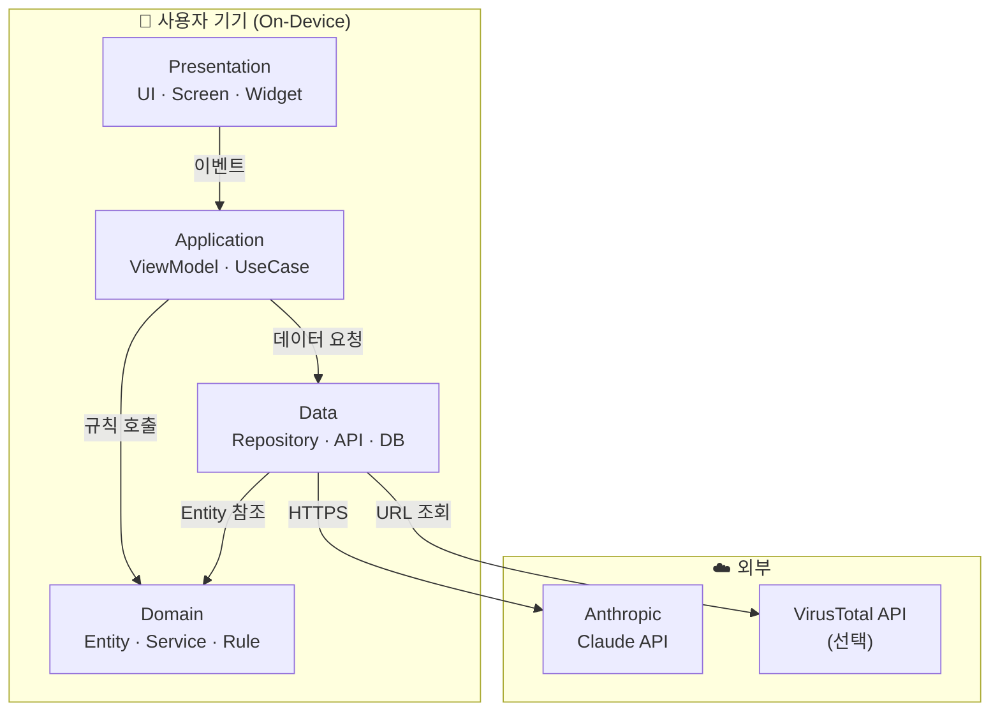
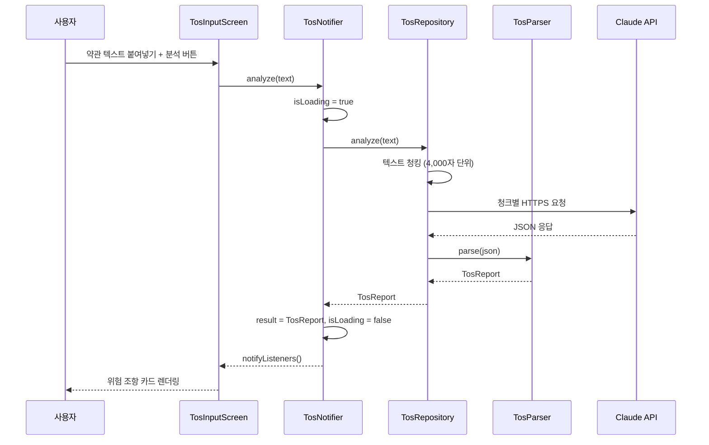

# Architecture — Guardian AI

> 이 문서는 Guardian AI의 시스템 구조를 **사람이 읽기 쉬운 형태**로 정리한 문서입니다.  
> 설계 상세는 `.planning/03-architecture.md` 참조.

---

## 한 줄 요약

Guardian AI는 **Flutter 단일 앱**으로, 별도 백엔드 서버 없이 Claude API를 직접 호출합니다.  
모든 민감 데이터는 기기 안에서만 처리하며, 원문 텍스트는 서버에 저장하지 않습니다.

---

## 전체 시스템 구조



---

## 레이어 설명

### Presentation — 화면

사용자가 보는 모든 것. 입력을 받아 Application 레이어로 전달하고, 결과를 화면에 표시합니다.

| 화면 | 역할 |
|------|------|
| `onboarding_screen` | 최초 실행 시 앱 목적 안내 (3단계) |
| `home_screen` | 최근 분석 요약 대시보드 |
| `pii_screen` | 텍스트 입력 → PII 마스킹 결과 |
| `tos_input_screen` | 약관 붙여넣기 / 파일 업로드 |
| `tos_result_screen` | 위험 조항 카드 뷰 (🔴🟡🟢) |
| `phishing_screen` | URL / 문자 입력 → 피싱 판정 |
| `history_screen` | 과거 분석 목록 |

### Application — 상태와 흐름

화면과 도메인 사이의 조율자. 로딩·에러·결과 상태를 관리하고, 데이터 요청 흐름을 조율합니다.  
Provider `ChangeNotifier` 패턴을 사용합니다.

```
PiiNotifier / TosNotifier / PhishingNotifier / HistoryNotifier
```

### Domain — 핵심 규칙

외부 의존이 없는 순수 Dart 코드. Guardian AI의 진짜 두뇌입니다.

| 파일 | 역할 |
|------|------|
| `pii_detector.dart` | 정규식 기반 PII 탐지 (전화번호, 이메일, 주민번호 등) |
| `masking_utils.dart` | 마스킹 강도 조절 (부분 / 완전) |
| `tos_prompt.dart` | 약관 분석용 Claude 프롬프트 설계 |
| `tos_parser.dart` | API JSON 응답 → TosReport 구조체 변환 |
| `url_analyzer.dart` | URL 구조 분석 (도메인 유사도, HTTPS 여부 등) |
| `smishing_patterns.dart` | 한국어 스미싱 키워드 패턴 DB |
| `risk_scorer.dart` | 피싱 종합 위험 점수 산출 |

### Data — 외부 데이터

API 호출과 로컬 저장소를 담당합니다. Repository 패턴으로 데이터 소스를 추상화합니다.

| 구성 | 역할 |
|------|------|
| `tos_repository` | 약관 텍스트 청킹 → API 병렬 호출 → 결과 병합 |
| `claude_client` | Claude API 공통 HTTP 클라이언트 |
| `local_db` | SQLite 히스토리 저장 (원문 제외, 결과 요약만) |
| `cache_service` | 동일 입력 해시 기반 중복 API 호출 방지 |

---

## 핵심 데이터 흐름 — 약관 분석



---

## 의존 방향 규칙

```
Presentation → Application → Domain ← Data
```

| 방향 | 허용 |
|------|------|
| Presentation → Application | ✅ |
| Application → Domain | ✅ |
| Application → Data | ✅ |
| Data → Domain (Entity만) | ✅ |
| Domain → Data | ❌ |
| Data → Application | ❌ |
| Data → Presentation | ❌ |

---

## 핵심 의사결정 요약

| 결정 | 선택 | 이유 | ADR |
|------|------|------|-----|
| 모바일 플랫폼 | Flutter | 1인 + 6주, Android/iOS 동시 지원 | ADR-0001 |
| 상태 관리 | Provider | 학습 비용 최소, MVP 규모 적합 | ADR-0002 |
| 백엔드 | 없음 (직접 호출) | Privacy First, 일정 절약 | ADR-0003 |
| 인증 | 없음 (로컬 전용) | Won't Have 명시, 데이터 미수집 | ADR-0004 |
| 배포 | APK 직접 배포 | 심사 없음, 발표 당일 즉시 대응 | ADR-0005 |

---

*연관 문서: `.planning/03-architecture.md` (설계 상세), `docs/setup.md` (환경 구축)*
