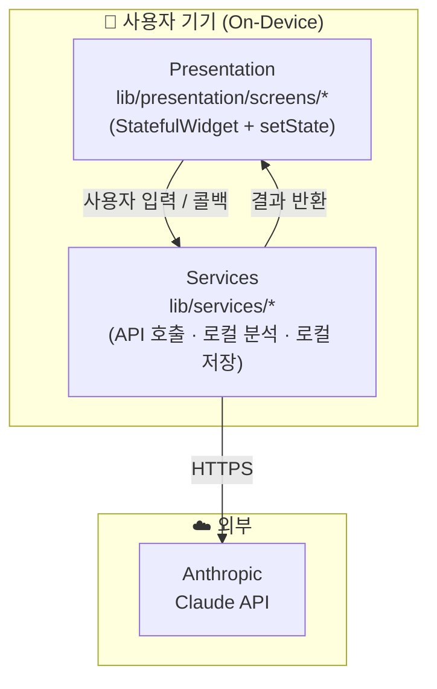
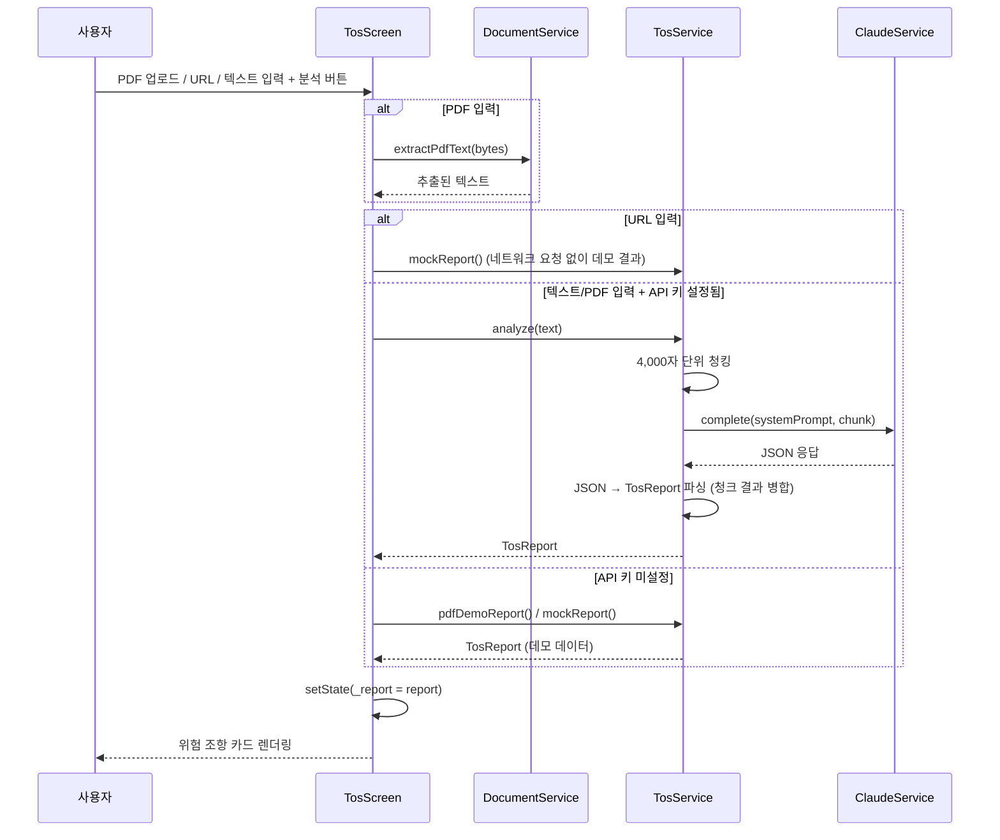

# Architecture — Guardian AI

> 이 문서는 Guardian AI의 **실제 구현 구조**를 사람이 읽기 쉬운 형태로 정리한 문서입니다.
> 초기 설계 구상은 `.planning/03-architecture.md`를 참고하세요 (MVP 범위 축소로 일부는 구현되지 않았습니다 — 차이점은 본 문서 하단 참고).

---

## 한 줄 요약

Guardian AI는 **Flutter 단일 앱**으로, 별도 백엔드 서버 없이 Claude API를 직접 호출합니다.
모든 민감 데이터는 기기 안에서만 처리하며, 원문 텍스트는 서버에 저장하지 않습니다.

---

## 전체 시스템 구조



---

## 레이어 설명

### Presentation — `lib/presentation/screens/`

사용자가 보는 모든 것. 입력을 받아 Services를 직접 호출하고, 결과를 `setState`로 화면에 반영합니다.

| 화면 | 역할 |
|------|------|
| `home_screen` | 활동 요약 대시보드, 다른 화면으로 진입점 (하단 탭) |
| `tos_screen` | 약관 분석 — PDF 업로드 / URL 입력 / 텍스트 직접 입력 (하단 탭) |
| `phishing_screen` | URL·문자·이메일 입력 → 피싱 판정 (하단 탭) |
| `notifications_screen` | 공지사항 목록 (홈에서 Navigator로 진입) |
| `history_screen` | 약관/피싱 분석 이력 목록 (홈에서 Navigator로 진입) |

`lib/presentation/theme/app_them.dart`에 공통 컬러·테마를 정의합니다.

### Services — `lib/services/`

API 호출, 로컬 분석 로직, 로컬 저장소를 담당하는 순수 Dart 클래스들입니다. 화면에서 직접 호출됩니다.

| 파일 | 역할 |
|------|------|
| `claude_service.dart` | Claude API 공통 HTTP 클라이언트 (`ClaudeService.complete`, `isConfigured`) |
| `tos_service.dart` | 약관 분석 — 4,000자 단위 청킹, Claude 프롬프트 구성, JSON → `TosReport` 파싱, `mockReport`/`pdfDemoReport` |
| `phishing_service.dart` | 피싱 1차 로컬 판정 (키워드/단축URL/도메인) + Claude 2차 판정, 오류 시 로컬 결과로 fallback |
| `document_service.dart` | PDF 바이트 → 텍스트 추출 (`syncfusion_flutter_pdf`) |
| `web_file_picker.dart` / `_web.dart` / `_stub.dart` | 웹에서 `<input type="file">` DOM 오버레이로 PDF 선택 (조건부 export) |
| `history_service.dart` | 분석 이력(`shared_preferences`, 최대 20건) 저장/조회 |
| `activity_service.dart` | 약관 분석/피싱 검사 횟수 등 통계 기록 |
| `notification_service.dart` | 공지사항 데이터 및 읽음 상태 관리 |

---

## 상태 관리

화면별로 `StatefulWidget` + `setState`를 사용합니다. 화면 간 공유 상태는 `app.dart`의 `_AppState`(현재 탭 인덱스)
정도이며, 분석 결과·이력·통계는 각 Service 클래스(`HistoryService`, `ActivityService`)가
`shared_preferences` 기반으로 보관하고 화면에서 직접 조회합니다.

> ADR-0002에서는 Provider(`ChangeNotifier`) 도입을 검토했으나, 화면이 3개(홈/약관/피싱)뿐인 MVP 규모에서는
> 화면 간 상태 공유 요구가 거의 없어 `setState`만으로 충분했습니다. 앱 규모가 커지면 ADR-0002의 Provider
> 마이그레이션 경로를 따릅니다.

---

## 핵심 데이터 흐름 — 약관 분석



---

## 의존 방향 규칙

```
Presentation → Services → Claude API
```

| 방향 | 허용 |
|------|------|
| Presentation → Services | ✅ |
| Services → Claude API (HTTPS) | ✅ |
| Services → Presentation | ❌ |
| Services 간 상호 참조 (예: `tos_service` → `claude_service`) | ✅ (단방향) |

---

## 핵심 의사결정 요약

| 결정 | 선택 | 이유 | ADR |
|------|------|------|-----|
| 모바일 플랫폼 | Flutter | 1인 + 6주, Android/iOS 동시 지원 | ADR-0001 |
| 상태 관리 | StatefulWidget + setState (Provider는 검토 후 MVP 범위에서 보류) | 화면 3개 규모에서 화면 간 상태 공유 요구가 적어 `setState`로 충분 | ADR-0002 |
| 백엔드 | 없음 (직접 호출) | Privacy First, 일정 절약 | ADR-0003 |
| 인증 | 없음 (로컬 전용) | Won't Have 명시, 데이터 미수집 | ADR-0004 |
| 배포 | APK 직접 배포 | 심사 없음, 발표 당일 즉시 대응 | ADR-0005 |

---

## `.planning/03-architecture.md`와의 차이점

초기 설계 구상(`.planning/03-architecture.md`)은 Presentation/Application/Domain/Data
4계층 + Provider + SQLite + 도메인별 분리 파일(`tos_prompt.dart`, `risk_scorer.dart` 등)을
가정했습니다. 6주 MVP 범위에서는 다음과 같이 축소되었습니다.

- **계층**: 4계층 → Presentation + Services 2계층
- **상태 관리**: Provider `ChangeNotifier` → `setState` (위 "상태 관리" 절 참고)
- **로컬 저장소**: SQLite(`local_db`) → `shared_preferences` (`history_service.dart`, `activity_service.dart`)
- **도메인 로직**: 별도 도메인 파일들 → 각 기능의 Service 파일(`tos_service.dart`, `phishing_service.dart`) 내부에 통합
- **화면**: `onboarding_screen`, `tos_input_screen`/`tos_result_screen` 분리 → 온보딩 없음, `tos_screen.dart` 하나로 통합

---

*연관 문서: `.planning/03-architecture.md` (초기 설계 구상), `docs/setup.md` (환경 구축)*
